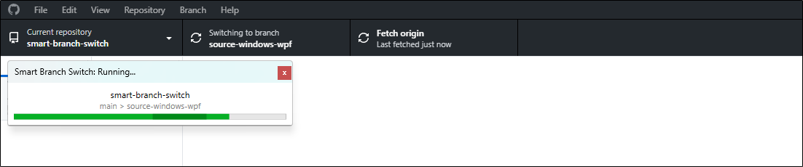

    
     
    Get the .bat/.sh script that Installs/Uninstalls the Smart Branch Switch in your Git Local Repository, on <a href="https://github.com/marcos4503/smart-branch-switch/releases">Releases</a> page.

    <b>Main Branches of the Project</b>
     
    <a href="https://github.com/marcos4503/smart-branch-switch">Main</a>
    •
    <a href="https://github.com/marcos4503/smart-branch-switch/tree/source-windows-wpf">Windows WPF Source Code</a>

# 🔀 What is the Smart Branch Switch?

Smart Branch Switch (or "SBS") is a tool whose main purpose is to help you work in an organized and clean way, while switching between active Branches (a.k.a. Branch Checkout) in your Git Local Repository, on your PC.

⭐ You know when you're on a Branch, and there are several files that are ignored there by the Branch's `.gitignore` file, but then you switch Branches and all those junk files ignored by the previous Branch follow you to the new Branch? **Smart Branch Switch solves that!**

⭐ You know when you have multiple Branches and end up forgetting to do things like configuring the `.gitignore` file or keeping it synchronized across all Branches, or you forget that some Branch has a file like `CONTRIBUTING.md` missing? **Smart Branch Switch solves that!**

The Smart Branch Switch can help you with these and other things in a non-destructive, non-intrusive, and high-performance way. The SBS helps you in an automated way, but without taking away your control in any way; that is, it doesn't make you dependent on the tool. It doesn't act like a completely invisible ghost that makes you forget how to solve problems manually. It doesn't make your knowledge obsolete.

### How does the Smart Branch Switch work?

Every Git Repository has a hidden folder called `.git` located in the Repository's root directory. If you decide to use SBS, it will be installed inside the `.git` folder of your Local Repository. What happens next is simple: whenever a Git binary interacts with your Local Repository to switch the active Branch, it will look for `Hooks` to execute automatically, once the Branch switch is complete. It will then find SBS and call it automatically. The SBS will run and will fulfill its functions. This applies to any Git binary that interacts with your Local Repository, whether it's Git Bash, your IDE's Git, GitHub Desktop, etc.

The SBS focuses only on the scope of your Git Local Repository. It only runs on your PC, within the scope of your Local Repository, and of course, only if you choose to install it in your Local Repository. Furthermore, when you install it, Git doesn't track it files, which means that when you `Commit` and `Push`, on your Local Repository, nothing from the Smart Branch Switch goes to the Remote Repository. Therefore, if you work in a Repository with other people, and only you decide to use SBS on your PC, no problem! **No one but you will be affected by this.**

# ✨ Features

As you saw earlier, above, SBS performs several functions whenever it runs. The flow is basically this:

- Git switch the active Branch on your Local Repository.
- When finish, Git calls the SBS to run and pauses himself. **At this point, Git has finished all that it usually does.**
- The SBS runs all its functions.
- The SBS returns control to Git, and this only serves to Git send alert to IDEs, GitHub Desktop and others, that the active Branch switching task has 100% finished.
- And that's it!

Now take a closer look at all the functions of the Smart Branch Switch.

### 🧹 Management of Ignored Files

The SBS introduces a concept of "Branch Limbo". This means that SBS creates and manages a Limbo for each Branch that your Local Repository has. The SBS engine will automatically delete Limbos belonging to Branches that no Longer exist, and will create Limbos for Branches that do not yet have a Limbo.

The Limbos stores ignored files from each Branch in an isolated and secure way, keeping your Local Repository always organized and containing only the files that **REALLY belong** to the currently active Branch. No more junk files and files ignored by other Branches, polluting and disorganizing your Local Repository and your current Branch! 🧼

The Limbos are located inside the `sbs` folder, which is inside the `.git` folder of your Local Repository. **It's not recommended, and you don't even need to worry about inspecting the `sbs` folder**, as everything inside is automatically managed by the Smart Branch Switch. It keeps the `sbs` folder always free of junk and organized.

Now that you understand this concept, let's look at how the feature of `🧹 Management of Ignored Files` works. When this feature starts running, SBS will collect some context information from Git. This will allow it to know which Branch you left (a.k.a. **`Old Branch`**), which Branch you are now on (a.k.a. **`Current Branch`**), and other minor details.

After SBS collects this information, it will look at the `Old Branch` and retrieve the contents of all the `.gitignore` files that the `Old Branch` contains. This is important because all files ignored by the `Old Branch` remain in your Local Repository, even after switching to the `Current Branch`. Once SBS has the contents of the `.gitignore` files from the `Old Branch`, it will look at all the files currently existing in the Root and Subfolders of your Local Repository and compare them with the `.gitignore` files collected from the `Old Branch`. Now, the SBS knows which files was "leaked" from the `Old Branch` and need to be managed.

After mapping all the files in the Root and Subfolders of your Local Repository that need to be managed, it will separate these files into two lists, being `files that are ignored by the Old Branch but are NOT tracked by the Current Branch` and `files that are ignored by the Old Branch but ARE tracked by the Current Branch`. After performing this separation, it will begin processing each mapped file, following this flow:

- Try to **Copy** or **Move** the file to the `Old Branch` Limbo:
  - If the file **IS** tracked by the `Current Branch`, it will be **COPIED**.
  - If the file is **NOT** tracked by `Current Branch`, it will be **MOVED**.
- If the Copy/Move fails, it most likely means that the file is being used by some Process. If this is the case, SBS places that file in an **error list** and continues to the next file.

After finishing handling the mapped files, SBS will look at the **error list** and, if there are any files there, it will begin the **Error Resolution**. The **Error Resolution** consists of:

- **Notify:** SBS will notify you via a Dialog Box that there are still a number of files that have not been Moved/Copied to the `Old Branch` Limbo and it will recommend that you close Processes that may be using those files. You will have these options:
  - **Solve Errors:** In this case, SBS will attempt to Copy/Move all these files again. If any of them fail again, it will display the same Dialog Box again, but with an updated count of remaining error files.
  - **Skip Errors:** In this case, SBS will ignore all files that could not be Moved/Copied and will proceed. These files will remain in your `Current Branch` after the SBS execution is complete.

> [!NOTE]
> Note that all files within the `Old Branch` Limbo retain their original relative paths, maintaining the folder and file structure 100% identical to how it was in the `Old Branch`.

After saving all the files ignored by the `Old Branch` to the `Old Branch` Limbo, it will delete all **empty folders** from your Local Repository. This ensures your Repository is clean after the files are saved to Limbo.

As a final step, after saving files to Limbo and cleaning the Repository, SBS will then look at the Limbo of the `Current Branch` and retrieve all files from the Limbo of the `Current Branch` directly to the Local Repository. For each file existing in the `Current Branch` Limbo, SBS will execute the following flow:

- **If the Limbo file ALREADY exists in the Local Repository, in the active `Current Branch`:**
  - **Notify:** This is a conflict because the file that is in Limbo and about to be restored to the `Current Branch` already exists in the active `Current Branch`. In this case, SBS will attempt to resolve this conflict by presenting you with a Dialog Box asking you what to do. You will have these options:
    - **Overwrite:** Deletes the conflicting file in the `Current Branch` and retrieve the version that is in Limbo.
    - **Ignore:** The conflicting file in the `Current Branch` remains untouched. The Limbo version is still there.
    - **Overwrite All:** It does the same as **Overwrite**, but applies it to this and all subsequent occurrences.
    - **Ignore All:** It does the same as **Ignore**, but applies it to this and all subsequent occurrences.
- **If the Limbo file does NOT exist in the Local Repository, in the active `Current Branch`:**
  - **Move** the Limbo file to the `Current Branch`.

After that, any remaining files in the `Current Branch` Limbo are deleted, and this Limbo is emptied, being ready to save the files ignored by the `Current Branch` when you switch to another Branch!

> [!NOTE]
> Note that in this recovery of files from the `Current Branch` Limbo, the folder and file structure is kept identical to how it was saved when the `Current Branch` Limbo was previously populated.

### 🚫 Detection of Different `.gitignore` Files Through Branches

The SBS will look at the Root of all Branches and check if there are `.gitignore` files present there, and will verify if all `.gitignore` files in the Root of all Branches have the same rules.

If all `.gitignore` files in the Root of all Branches are not identical, SBS will present you with a warning Dialog Box. This Dialog Box contains an option to disable it and **prevent it from appearing again** in the future for this Repository.

**Why is this important?** These files are essential for Git to know what it should or shouldn't Tracked/Commited, preventing your Repository from being bloated with unnecessary files. Furthermore, these files are the cornerstone used by Smart Branch Switch to determine what should be saved to Limbo, or not, after an Branch switch.

Also, although Smart Branch Switch can handle different `.gitignore` files in each Branch (as seen in the last sub-topic), still efficiently cleaning up ignored files, having identical `.gitignore` files in the Root of all Branches ensures the most predictable operation of SBS, keeping your Local Repository organized according to the Branch you are on.

**Furthermore**, identical `.gitignore` files in the Roots of all Branches, guarantees that other people who clone your Repository on their PCs, and prefer not to use Smart Branch Switch, will not suffer from a mess of ignored files when switching Branches. Also, it improves the functionality and predictability of Git itself, avoiding unexpected behaviors.

### ⚠️ Detection of Existence of Untracked Files After SBS Run

Right after the Smart Branch Switch has finished its execution and done everything it needs to do, it will check if there are any Untracked files (not to be confused with Ignored files) in the currently active Branch in your Repository. If such files exist, it will notify you via a low-priority warning that will appear in a corner of the screen for a few seconds.

**Why is this useful?** If SBS was run, it means you just switched Branches. If there are Untracked files in your Repository, it means that some file came from the last Branch or SBS failed to save some file to the Limbo of the last Branch. It's good to know this.

### 💻 Detection of Branches Existing Only on Local Repository

The Smart Branch Switch will compare the Branches in your Local Repository with the Branches in your Remote Repository. If any Branch exists **only in your Local Repository**, it will notify you with a low-priority notification that will remain in a corner of the screen for a few seconds.

**Why is this useful?** This is useful for knowing if any Branch in your Local Repository has already been deleted from the Remote Repository. This means you can delete your local Branch as well. It's also useful for knowing if you forgot to publish a Branch you created in your Local Repository.

### 🛜 Detection of Branches Existing Only on Remote Repository

The Smart Branch Switch will compare the Branches in your Local Repository with the Branches in your Remote Repository. If any Branch exists **only in your Remote Repository**, it will notify you with a low-priority notification that will remain in a corner of the screen for a few seconds.

**Why is this useful?** This is useful for knowing if any Branch that exists in the Remote Repository has not yet been loaded to your Local Repository. If you don't want to load the Branch to your Local Repository, this feature is still useful for knowing when a Branch was created or ceased to exist in the Remote Repository. It can also be useful to remind you if you delete a Branch in the Local Repository but forget to delete it in the Remote Repository.

### 🪧 Detection of `README.md` File

After completing the Branch switch, SBS will check if the current Branch contains a `README.md` file on the Root. If it doesn't, it will notify you with a Dialog Box. This Dialog Box offers you the option to disable it, so it no longer appears in the Repository.

**Why is this useful?** This can be useful for maintaining consistency in Documentation/ReadMe across Branches. Additionally, it ensures that each Branch contains a ReadMe file, which can be helpful for people navigating between Branches in your Repository using the GitHub Website.

### 🤝 Detection of `CONTRIBUTING.md` File

After completing the Branch switch, SBS will check if the current Branch contains a `CONTRIBUTING.md` file. The SBS checks the following paths in your Local Repository:

- /CONTRIBUTING.md
- /.github/CONTRIBUTING.md
- /docs/CONTRIBUTING.md

If it doesn't, it will notify you with a Dialog Box. This Dialog Box offers you the option to disable it, so it no longer appears in the Repository. Additionally, this feature does not work for Branches named as `gh-pages`.

**Why is this useful?** It's useful to ensure that all Branches contain the Contribution guide, policies, and guidelines. This is good because GitHub will always offer the Contributor access and read this file in the Branch they want to modify.

### 📤 Detection of `PULL_REQUEST_TEMPLATE` File/Directory

After completing the Branch switch, SBS will check if the current Branch contains a `PULL_REQUEST_TEMPLATE` file/directory. The SBS checks the following paths in your Local Repository:

- /PULL_REQUEST_TEMPLATE.md
- /.github/PULL_REQUEST_TEMPLATE.md
- /docs/PULL_REQUEST_TEMPLATE.md
- /.github/PULL_REQUEST_TEMPLATE/

If it doesn't, it will notify you with a Dialog Box. This Dialog Box offers you the option to disable it, so it no longer appears in the Repository. Additionally, this feature does not work for Branches named as `gh-pages`.

**Why is this useful?** It's useful to ensure that all Branches contain a Pull Request Template. This definitely helps with the organization and standardization of the project and Repository. It's also good because GitHub will always use the template corresponding to the Branch that the Contributor wants to modify.

# 📥 Using Smart Branch Switch on Your Local Repository

The procedure for installing the Smart Branch Switch in your Repository is quite simple. The SBS has a BAT or SH script (depending on the OS you intend to use) to install SBS in your Local Repository.

### 🪟 On Windows

- Access the <a href="https://github.com/marcos4503/smart-branch-switch/releases">Releases</a> page of this Repository and look for the latest Release. In the Assets of that Release, download the file with the `.bat` extension.
- Go to your Local Repository and switch to `main` Branch, or the Branch set as the Main Branch, in your Repository.
- Copy the `.bat` file you downloaded to the Root of your Local Repository. If it has a name like `default.SMART-BRANCH-SWITCH.bat`, you can delete the `default` prefix if you want.
- Now, run the `.bat` file that you copied to your Local Repository. The script will detect that the Smart Branch Switch is not installed on your Local Repository and will proceed to the installation. You then just need to confirm that you want to install Smart Branch Switch and follow the installation flow.
- After installation, you should see a success message. The next time you open the `.bat` file, it will give you options such as Install, Update, Uninstall, View Logs, and other useful functions for managing the Smart Branch Switch in your Local Repository.

### 🐧 On Linux

- The Smart Branch Switch does not yet have a Linux version.

> [!NOTE]
> You don't need to keep the BAT/SH file in your Local Repository if you don't want to. Also, the name of the BAT/SH file doesn't matter. If you want to change the name, you can do so without any problems.

# ⏱️ Tips for Better Performance

If you want to ensure that the Smart Branch Switch runs at peak performance and without unexpected issues while you work on your Local Repository, follow the tips below!

### 🔍 Disable Windows File Indexing

Disable <a href="https://support.microsoft.com/en-us/windows/search-indexing-in-windows-da061c83-af6b-095c-0f7a-4dfecda4d15a">Windows File Indexing</a> for your Local Repository, or for the parent folder of your Local Repository. This helps Windows avoid indexing files it shouldn't in certain cases, improving overall performance.

### 🛡️ Disable Antivirus Scan (Optional)

There are antivirus programs (mainly Windows Defender) known for monitoring file movement on your PC. This undoubtedly affects Git Local Repositories and can significantly impact Smart Branch Switch, as it does this quite often, depending on the project type. To resolve this, you can configure your antivirus to disable automatic checks or scans on your Local Repository or its parent folder.